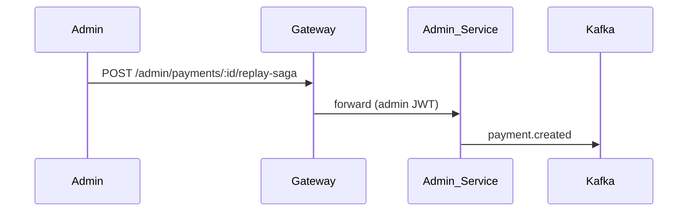

# Admin Service

Operations API for payment inspection, saga replay, and audit log access. Requires `admin` JWT role (via gateway `/admin/*` or direct with JWT).

| Property | Value |
|----------|-------|
| Port | `8011` |
| Auth | JWT + role `admin` |

## Routes

| Method | Path | Description |
|--------|------|-------------|
| GET | `/admin/payments` | List payments from shared DB |
| GET | `/admin/audit` | List audit events |
| POST | `/admin/payments/:id/replay-saga` | Republish `payment.created` to Kafka |

## Workflow

See [docs/ENHANCEMENTS.md](../../docs/ENHANCEMENTS.md).
