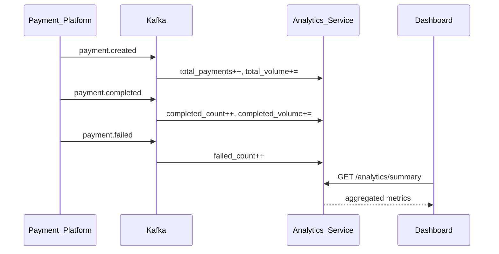
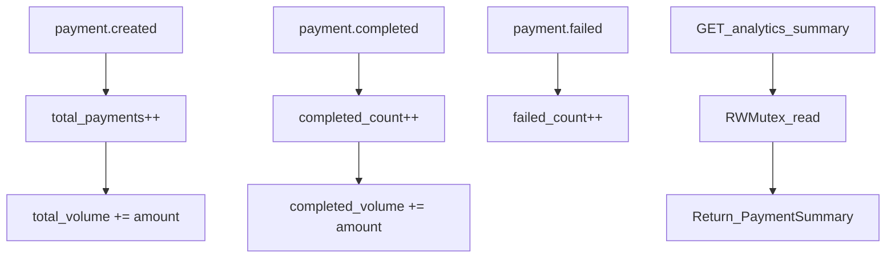
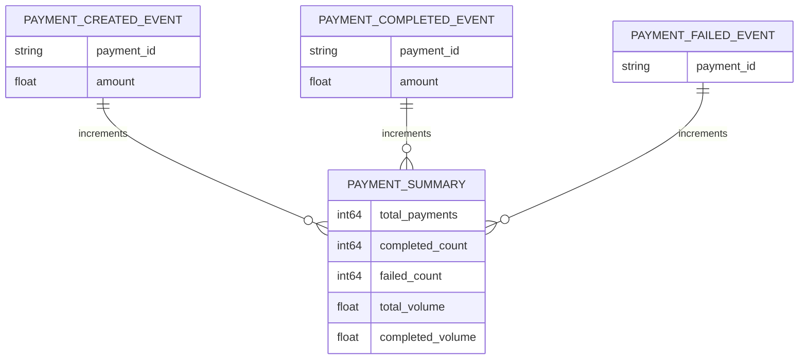

# Analytics Service

Aggregates payment metrics in memory from Kafka events and exposes a summary API for dashboards and monitoring.

| Property | Value |
|----------|-------|
| Port | `8010` |
| Stack | Gin, Kafka |
| Persistence | In-memory counters |

## Responsibilities

- Consume payment lifecycle events
- Track totals: payments created, completed, failed
- Track volume: total and completed amounts
- Expose aggregated summary via REST

## API Routes

| Method | Path | Description |
|--------|------|-------------|
| GET | `/analytics/summary` | Payment metrics summary |
| GET | `/health` | Health check |
| GET | `/metrics` | Prometheus metrics |

## Summary Response

```json
{
  "total_payments": 150,
  "completed_count": 120,
  "failed_count": 10,
  "total_volume": 45000.00,
  "completed_volume": 38000.00
}
```

## Workflow





## ERD (In-Memory)



## Kafka Topics

| Topic | Counter updated |
|-------|-----------------|
| `payment.created` | `total_payments`, `total_volume` |
| `payment.completed` | `completed_count`, `completed_volume` |
| `payment.failed` | `failed_count` |

## Run

```bash
HTTP_PORT=8010 KAFKA_BROKERS=localhost:9092 go run ./cmd/server
```
