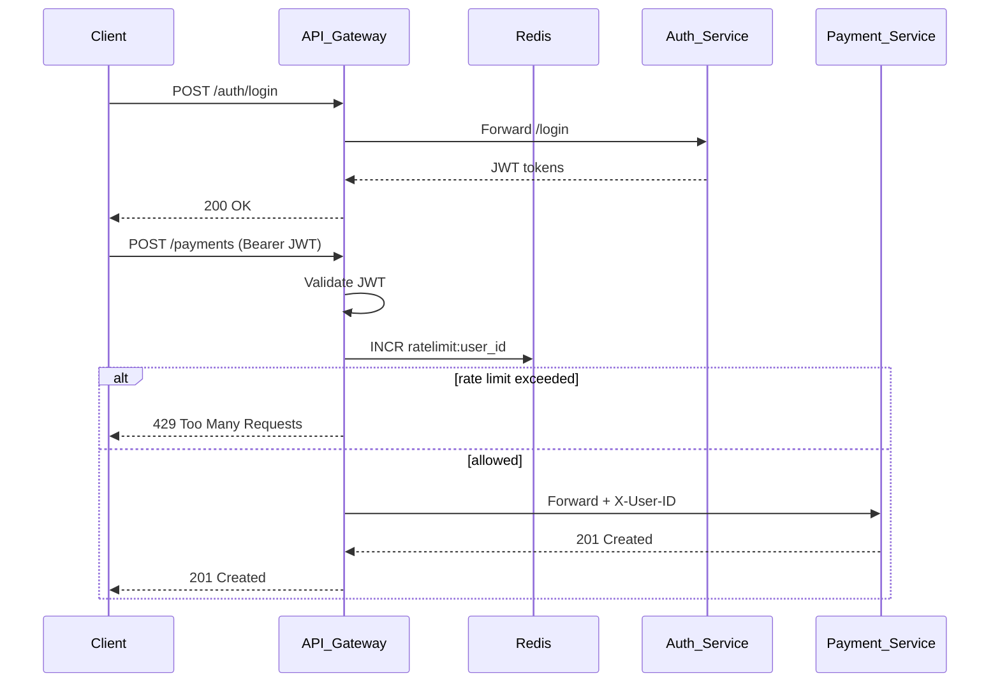
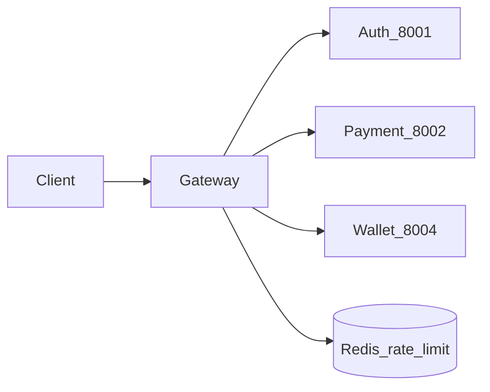
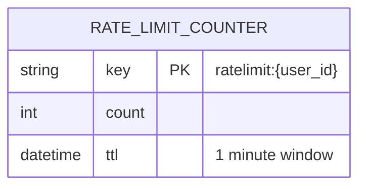

# API Gateway

Single entry point for clients. Routes authenticated traffic to downstream services, enforces JWT validation, Redis rate limiting, and propagates correlation IDs.

| Property | Value |
|----------|-------|
| Port | `8000` |
| Stack | Gin, Redis, JWT |
| Persistence | None (stateless proxy) |

## Responsibilities

- Request routing to auth, payment, and wallet services
- JWT verification on protected routes
- Sliding-window rate limiting (`ratelimit:{user_id}`)
- Correlation ID injection (`X-Correlation-ID`)
- User ID propagation (`X-User-ID`)

## API Routes

| Method | Path | Auth | Proxies to |
|--------|------|------|------------|
| GET | `/health` | No | — |
| POST | `/auth/signup` | No | auth-service |
| POST | `/auth/login` | No | auth-service |
| POST | `/auth/refresh` | No | auth-service |
| POST | `/payments` | JWT | payment-service |
| GET | `/payments/:id` | JWT | payment-service |
| POST | `/refunds` | JWT | payment-service |
| GET | `/wallet` | JWT | wallet-service |
| GET | `/metrics` | No | Prometheus |

## Workflow





## Data Model (Redis)

No relational database. Rate-limit state only:



| Redis Key | TTL | Purpose |
|-----------|-----|---------|
| `ratelimit:{user_id}` | 1m | Request count per user/IP |

## Configuration

| Env | Default |
|-----|---------|
| `HTTP_PORT` | `8000` |
| `AUTH_SERVICE_URL` | `http://localhost:8001` |
| `PAYMENT_SERVICE_URL` | `http://localhost:8002` |
| `WALLET_SERVICE_URL` | `http://localhost:8004` |
| `REDIS_URL` | `redis://localhost:6379/0` |
| `JWT_SECRET` | (shared with auth-service) |

## Run

```bash
HTTP_PORT=8000 go run ./cmd/server
```
