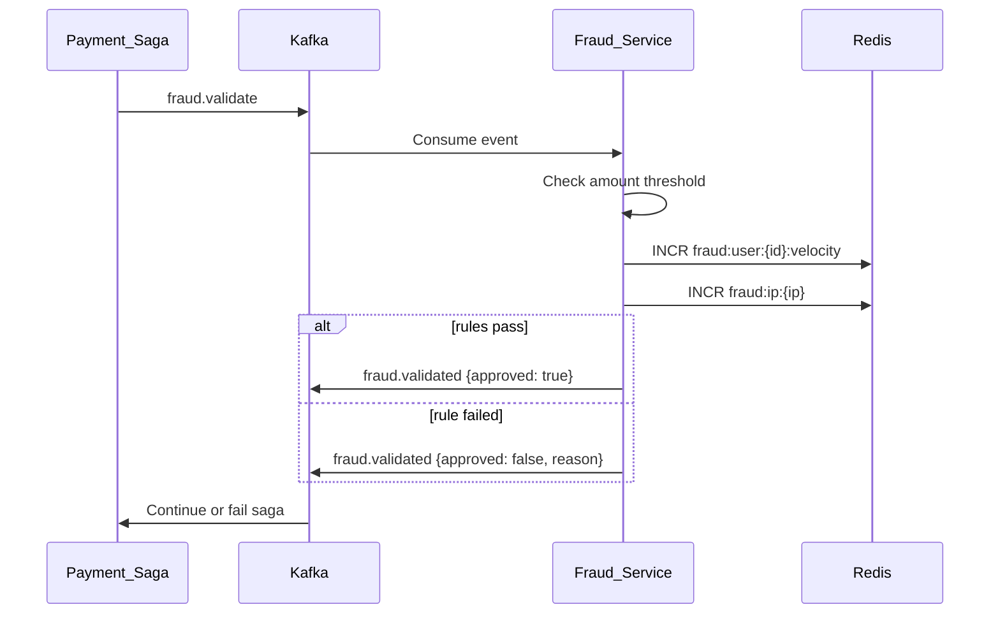
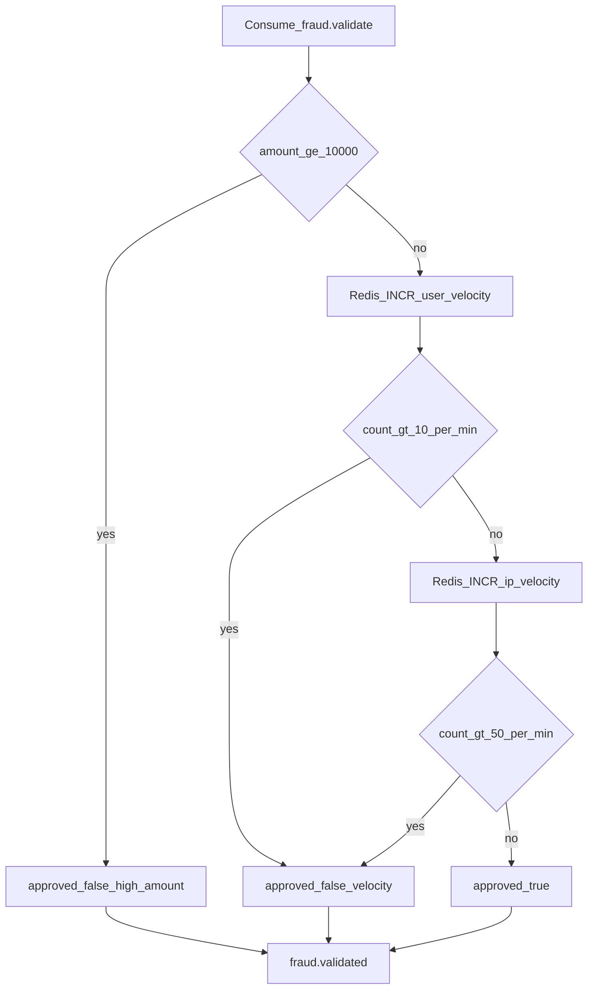
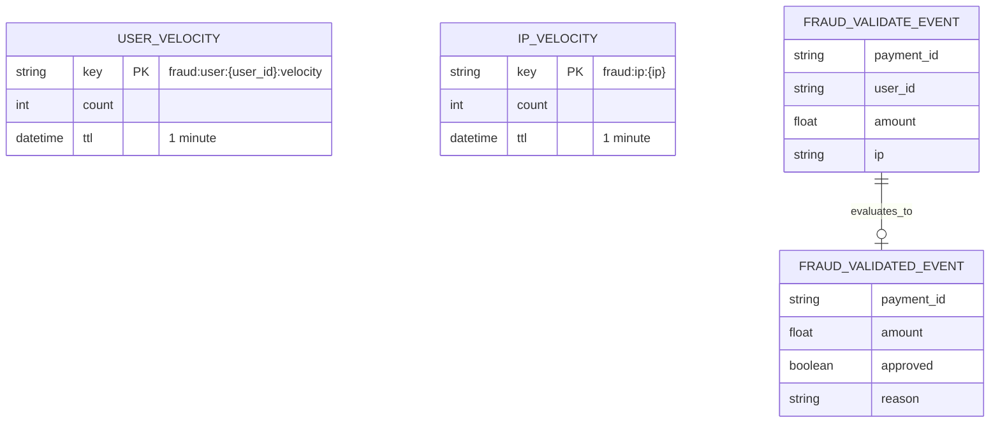

# Fraud Service

Redis-backed fraud detection with velocity rules and amount thresholds. Validates payments in the saga before provider charging.

| Property | Value |
|----------|-------|
| Port | `8006` |
| Stack | Redis, Kafka |
| Persistence | Redis only |

## Responsibilities

- Consume `fraud.validate` events from the payment saga
- Velocity checks per user and IP
- High-amount threshold rejection
- Publish `fraud.validated` with approval decision

## Risk Rules

| Rule | Threshold | Action |
|------|-----------|--------|
| User velocity | > 10 requests / minute | Reject |
| IP velocity | > 50 requests / minute | Reject |
| High amount | >= $10,000 | Reject |

## Workflow





## ERD (Redis)

No relational database. Velocity counters stored in Redis:



## Redis Keys

| Key | TTL | Limit |
|-----|-----|-------|
| `fraud:user:{user_id}:velocity` | 1m | 10 |
| `fraud:ip:{ip}` | 1m | 50 |

## Kafka Topics

| Topic | Direction |
|-------|-----------|
| `fraud.validate` | Consume |
| `fraud.validated` | Produce |

## Run

```bash
HTTP_PORT=8006 REDIS_URL=redis://localhost:6379/0 KAFKA_BROKERS=localhost:9092 go run ./cmd/server
```
