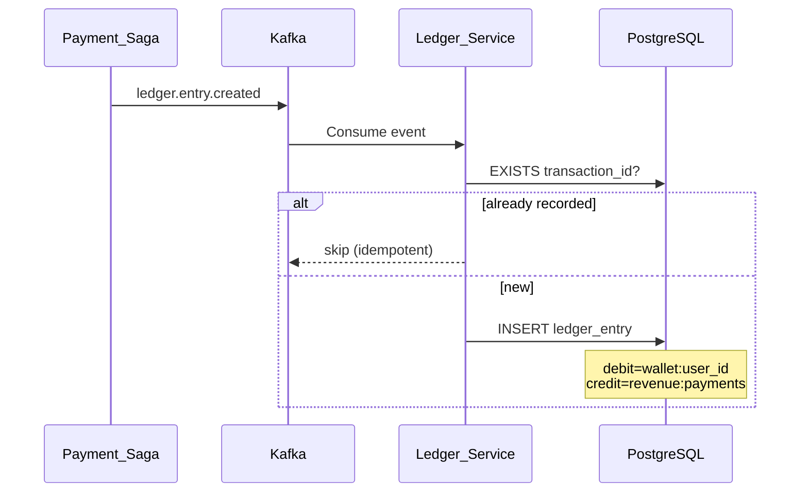
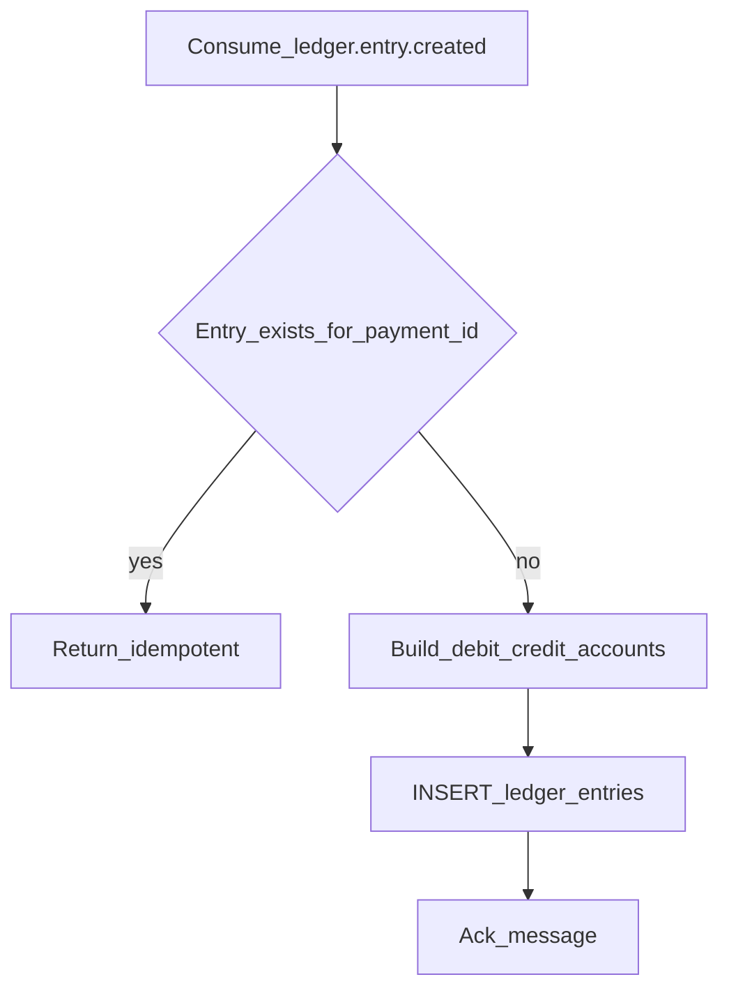
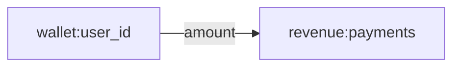
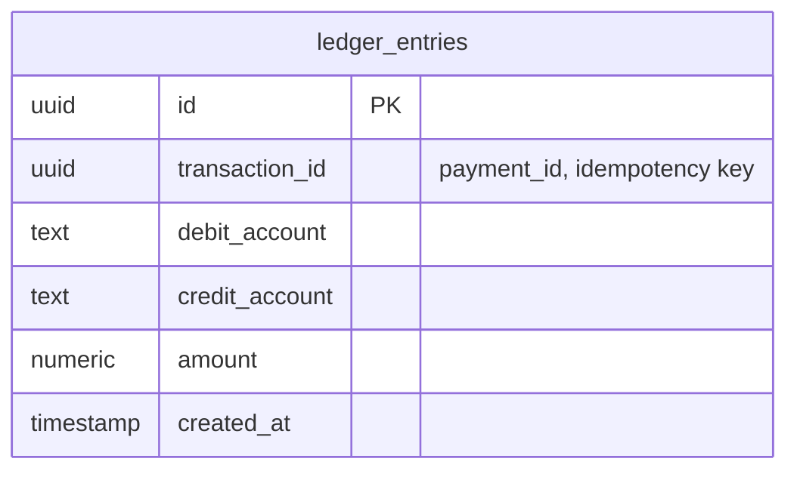

# Ledger Service

Immutable, append-only **double-entry accounting** ledger. Every financial movement is recorded as balanced debit/credit entries and never updated in place.

| Property | Value |
|----------|-------|
| Port | `8005` |
| Stack | PostgreSQL, Kafka |
| Persistence | PostgreSQL |

## Responsibilities

- Record double-entry ledger rows on `ledger.entry.created` events
- Enforce append-only writes (no UPDATE/DELETE on entries)
- Idempotent processing by `transaction_id` (payment_id)
- Default accounts: `wallet:{user_id}` → `revenue:payments`

## Workflow





## Double-Entry Model

Every payment produces one balanced entry:

| Debit Account | Credit Account | Meaning |
|---------------|----------------|---------|
| `wallet:{user_id}` | `revenue:payments` | Funds moved from user wallet to revenue |



## ERD



| Constraint | Rule |
|------------|------|
| Append-only | No UPDATE or DELETE on `ledger_entries` |
| Balance | Each row represents one side of a balanced transaction |
| Idempotency | Unique processing per `transaction_id` |
| Amount | `CHECK (amount > 0)` |

## Indexes

- `idx_ledger_entries_transaction_id` — idempotency lookups
- `idx_ledger_entries_created_at` — audit/time-range queries

## Kafka Topics

| Topic | Direction |
|-------|-----------|
| `ledger.entry.created` | Consume |

## Run

```bash
HTTP_PORT=8005 go run ./cmd/server
```

Migrations: `migrations/001_init.sql`
