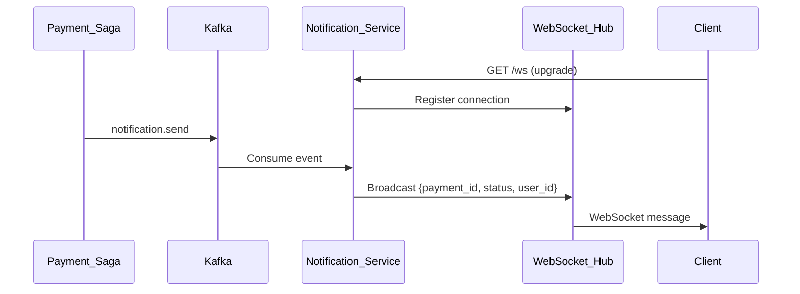
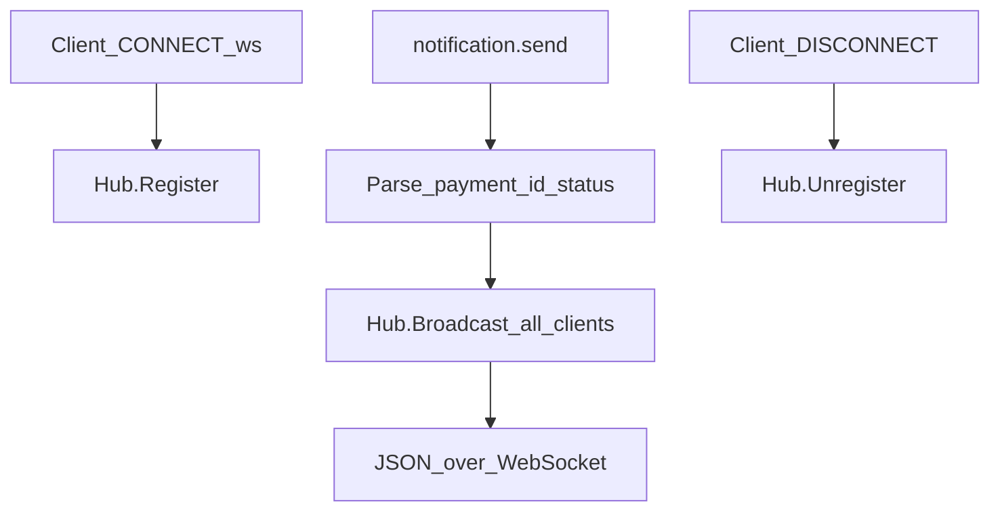
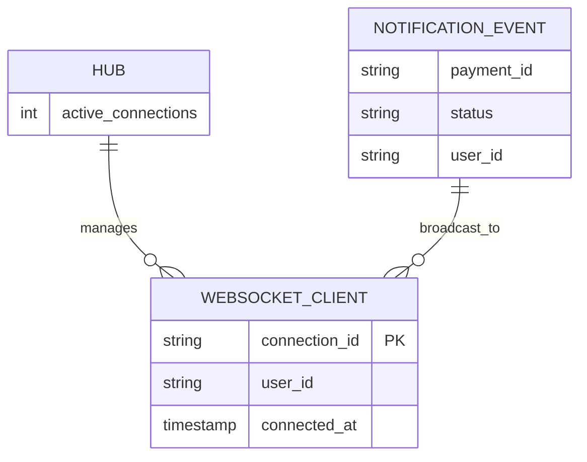

# Notification Service

Delivers real-time payment status updates via WebSocket. Consumes Kafka notification events and broadcasts to connected clients.

| Property | Value |
|----------|-------|
| Port | `8007` |
| Stack | Gin, WebSocket, Kafka |
| Persistence | In-memory hub (no database) |

## Responsibilities

- Consume `notification.send` events
- Broadcast payment status to WebSocket subscribers
- Maintain in-memory connection hub

## API Routes

| Method | Path | Description |
|--------|------|-------------|
| GET | `/ws` | WebSocket upgrade for real-time updates |
| GET | `/health` | Health check |
| GET | `/metrics` | Prometheus metrics |

## Workflow





## WebSocket Message Format

```json
{
  "payment_id": "uuid",
  "status": "completed",
  "user_id": "uuid"
}
```

## ERD

No persistent storage. In-memory connection model:



## Kafka Topics

| Topic | Direction |
|-------|-----------|
| `notification.send` | Consume |

## Run

```bash
HTTP_PORT=8007 KAFKA_BROKERS=localhost:9092 go run ./cmd/server
```

Connect via: `ws://localhost:8007/ws`
