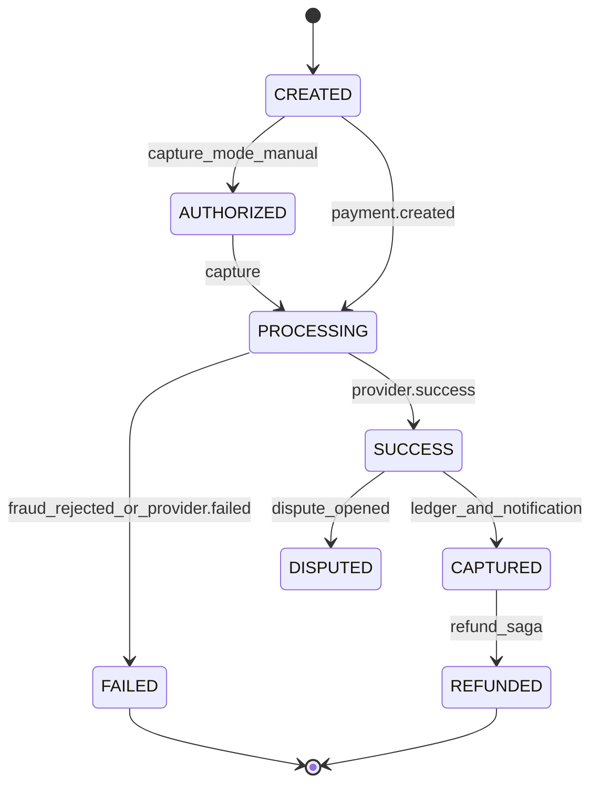
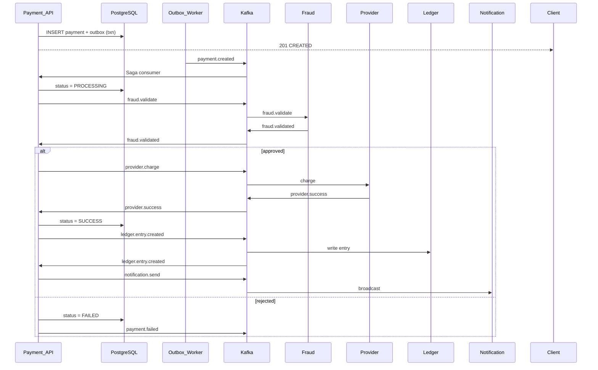
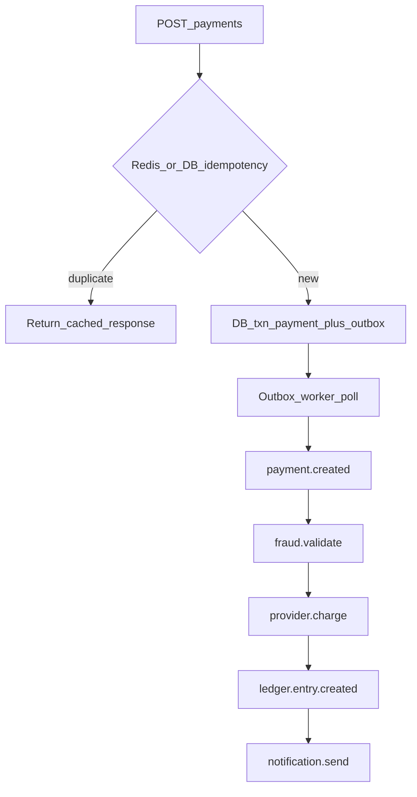
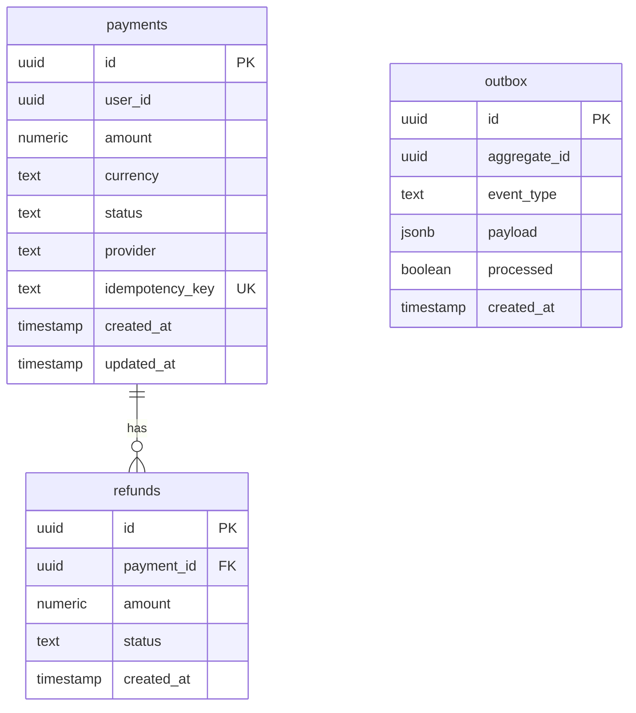

# Payment Service

Core orchestrator for the payment lifecycle. Coordinates the distributed saga, enforces idempotency, and uses the transactional outbox pattern for reliable Kafka publishing.

| Property | Value |
|----------|-------|
| Port | `8002` |
| Stack | Gin, PostgreSQL, Redis, Kafka |
| Persistence | PostgreSQL + Redis |

## Responsibilities

- Payment CRUD and refund initiation
- State machine: `CREATED → PROCESSING → SUCCESS | FAILED → REFUNDED`
- Transactional outbox (DB + event in one transaction)
- Saga coordination via Kafka consumers
- Redis idempotency for duplicate requests

## API Routes

| Method | Path | Headers | Description |
|--------|------|---------|-------------|
| POST | `/payments` | `X-User-ID`, `Idempotency-Key` | Create payment |
| GET | `/payments/:id` | `X-User-ID` | Get payment by ID |
| POST | `/refunds` | `X-User-ID` | Refund a successful payment |
| GET | `/health` | — | Health check |
| GET | `/metrics` | — | Prometheus metrics |

## Payment State Machine



## New APIs (enhancements)

| Method | Path | Description |
|--------|------|-------------|
| POST | `/payment-methods` | Tokenize payment method |
| GET | `/payments` | List user payments |
| POST | `/payments/:id/capture` | Capture authorized hold |
| POST | `/disputes` | Open dispute |

Refund saga enabled by default (`FEATURE_REFUND_SAGA=false` to disable).

## Saga Workflow





## ERD



## Redis Keys

| Key | TTL | Purpose |
|-----|-----|---------|
| `idempotency:{key}` | 48h | Cached payment response |
| `idempotency:{key}:lock` | 30s | In-flight request lock |

## Kafka Topics

| Topic | Role |
|-------|------|
| `payment.created` | Produced (outbox), consumed (saga start) |
| `fraud.validate` | Produced |
| `fraud.validated` | Consumed |
| `provider.charge` | Produced |
| `provider.success` / `provider.failed` | Consumed |
| `ledger.entry.created` | Produced & consumed |
| `notification.send` | Produced |
| `payment.failed` | Produced on failure |

## Run

```bash
HTTP_PORT=8002 go run ./cmd/server
```

Migrations: `migrations/001_init.sql`
