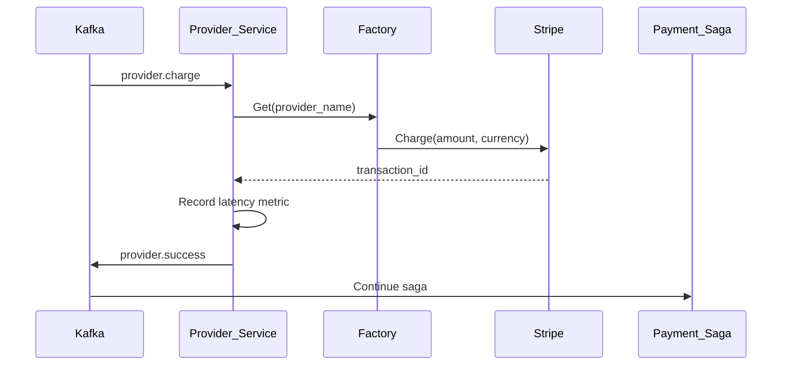
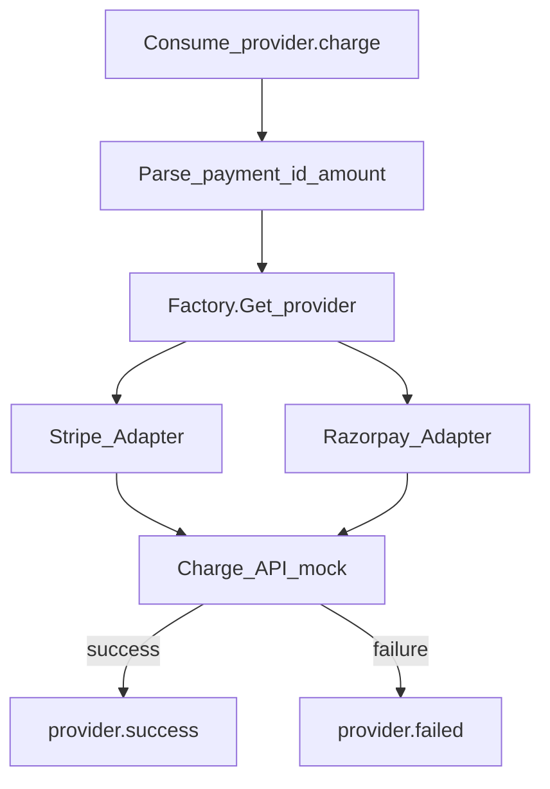
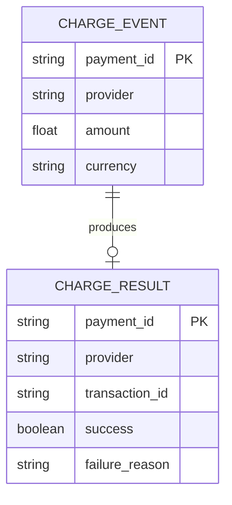

# Provider Service

Integrates with external payment providers via the **Factory**, **Strategy**, and **Adapter** patterns. Ships with mock Stripe and Razorpay implementations for local development.

| Property | Value |
|----------|-------|
| Port | `8003` |
| Stack | Kafka, Factory/Strategy pattern |
| Persistence | None (stateless) |

## Responsibilities

- Consume `provider.charge` events from the payment saga
- Route charges to the correct provider adapter (Stripe, Razorpay)
- Publish `provider.success` or `provider.failed`
- Record provider latency metrics

## Supported Providers

| Provider | Package | Behavior |
|----------|---------|----------|
| `stripe` | `internal/provider/stripe` | Mock charge (always succeeds) |
| `razorpay` | `internal/provider/razorpay` | Mock charge (always succeeds) |

## Provider Interface

```go
type PaymentProvider interface {
    Name() string
    Charge(ctx context.Context, req ChargeRequest) (transactionID string, err error)
}
```

## Workflow





## ERD

No relational database. Conceptual model of provider charge events:



## Kafka Topics

| Topic | Direction |
|-------|-----------|
| `provider.charge` | Consume |
| `provider.success` | Produce |
| `provider.failed` | Produce |

## Metrics

- `provider_latency_seconds{provider="stripe|razorpay"}`

## Run

```bash
HTTP_PORT=8003 KAFKA_BROKERS=localhost:9092 go run ./cmd/server
```
