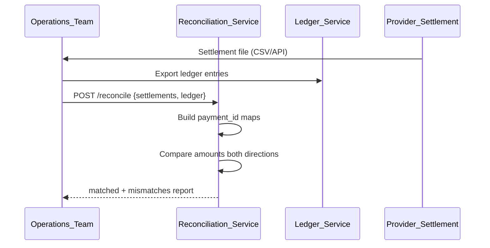
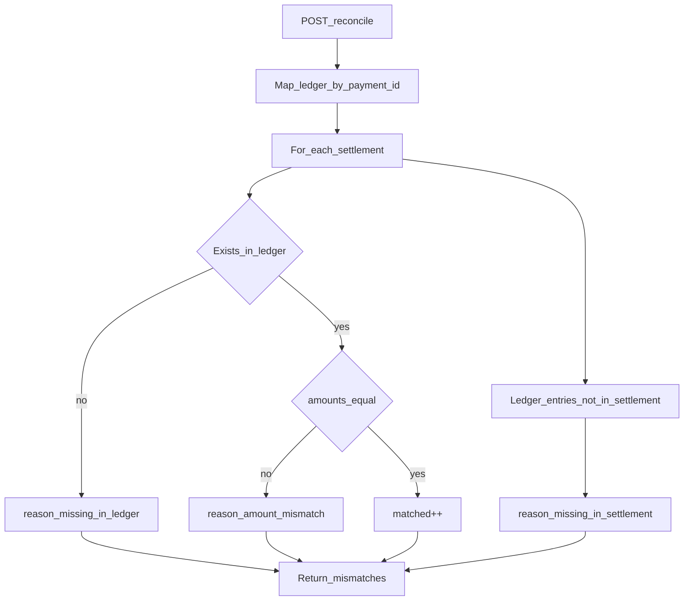
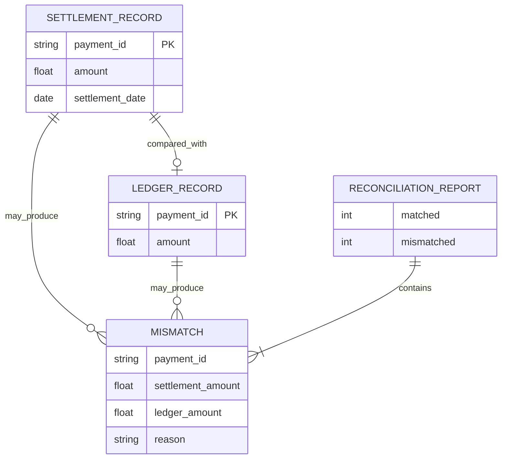

# Reconciliation Service

Compares provider settlement records against ledger entries to detect mismatches and support recovery workflows.

| Property | Value |
|----------|-------|
| Port | `8009` |
| Stack | Gin |
| Persistence | None (stateless comparison) |

## Responsibilities

- Accept settlement file data and ledger snapshot via API
- Match payments by `payment_id`
- Detect missing entries and amount mismatches
- Return reconciliation report with mismatch details

## API Routes

| Method | Path | Description |
|--------|------|-------------|
| POST | `/reconcile` | Compare settlements vs ledger |
| GET | `/health` | Health check |
| GET | `/metrics` | Prometheus metrics |

## Request / Response

**POST /reconcile**

```json
{
  "settlements": [
    { "payment_id": "uuid", "amount": 100.00 }
  ],
  "ledger": [
    { "payment_id": "uuid", "amount": 100.00 }
  ]
}
```

```json
{
  "matched": 8,
  "mismatched": 2,
  "mismatches": [
    {
      "payment_id": "uuid",
      "settlement_amount": 100.00,
      "ledger_amount": 99.00,
      "reason": "amount mismatch"
    }
  ]
}
```

## Workflow





## ERD (Logical)

Stateless service — input datasets are compared in memory:



## Mismatch Reasons

| Reason | Description |
|--------|-------------|
| `missing in ledger` | Settlement exists, no ledger entry |
| `amount mismatch` | Both exist, amounts differ |
| `missing in settlement` | Ledger entry with no settlement |

## Run

```bash
HTTP_PORT=8009 go run ./cmd/server
```
