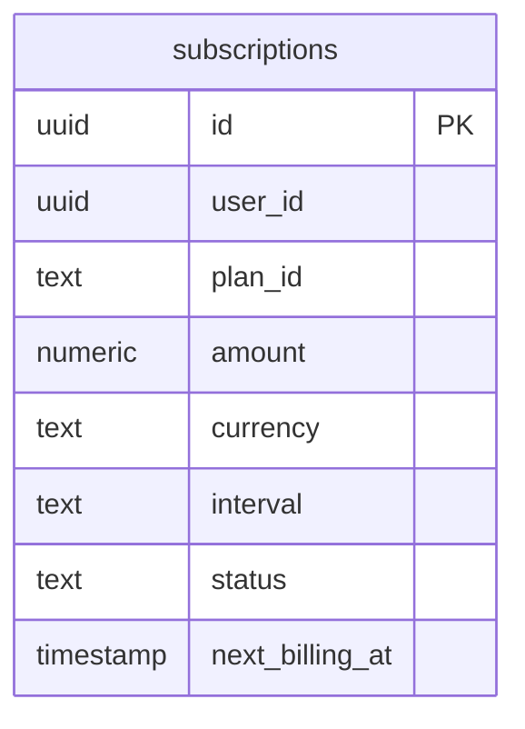
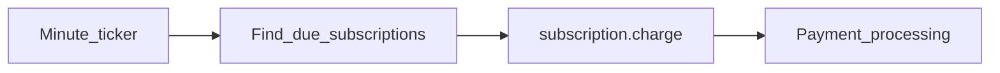

# Subscription Service

Recurring billing: subscription CRUD and scheduled `subscription.charge` Kafka events.

| Property | Value |
|----------|-------|
| Port | `8012` |
| Persistence | PostgreSQL |

## Routes

| Method | Path | Description |
|--------|------|-------------|
| POST | `/subscriptions` | Create subscription |
| GET | `/subscriptions/:id` | Get subscription |

## ERD

## Workflow

Migrations: `migrations/001_subscriptions.sql`
