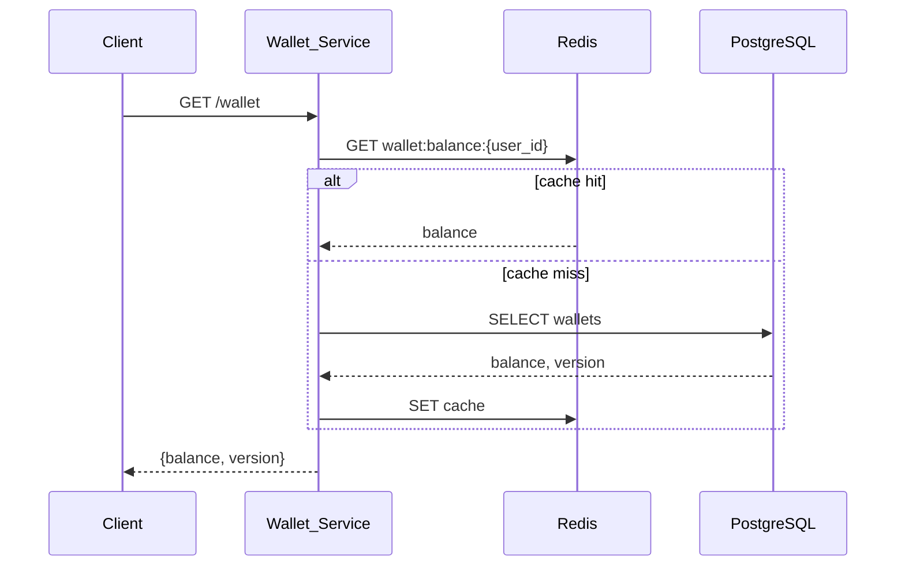
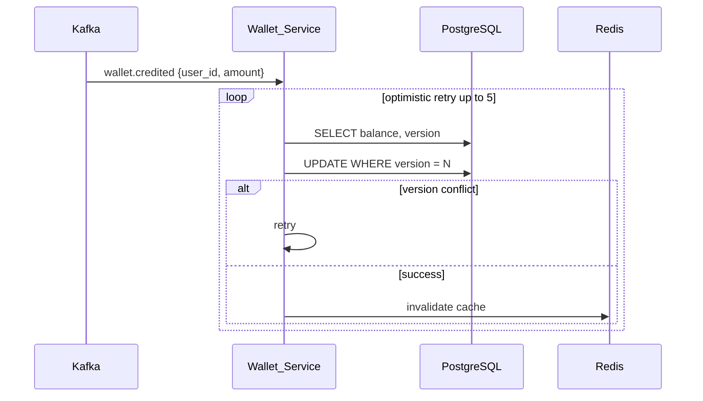
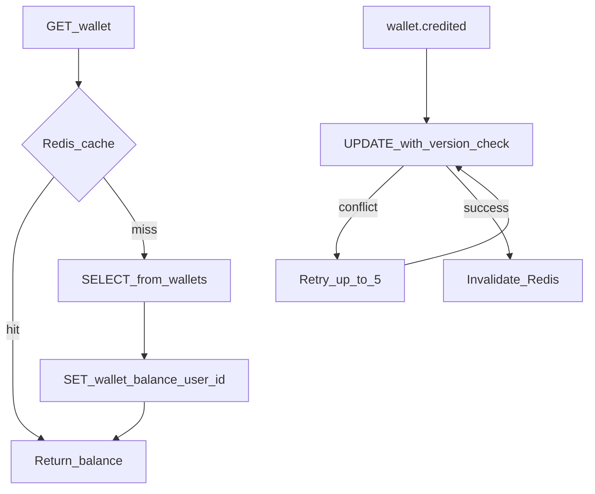
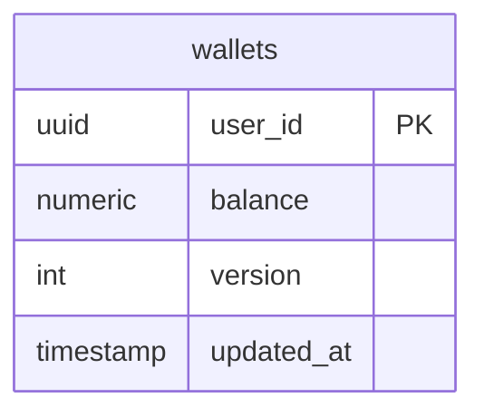

# Wallet Service

Manages user wallet balances with **optimistic locking** for concurrent updates and Redis caching for fast reads.

| Property | Value |
|----------|-------|
| Port | `8004` |
| Stack | Gin, PostgreSQL, Redis, Kafka |
| Persistence | PostgreSQL + Redis |

## Responsibilities

- Wallet balance reads (`GET /wallet`)
- Credit and debit operations with version-based optimistic locking
- Redis cache for balance (`wallet:balance:{user_id}`)
- Kafka consumers for `wallet.credited` and `wallet.debited` events

## API Routes

| Method | Path | Description |
|--------|------|-------------|
| GET | `/wallet` | Get balance (header `X-User-ID` or `?user_id=`) |
| GET | `/health` | Health check |
| GET | `/metrics` | Prometheus metrics |

## Workflow







## ERD



| Column | Description |
|--------|-------------|
| `version` | Incremented on every update; used for optimistic locking |
| `balance` | Current wallet balance (NUMERIC 18,2) |

## Optimistic Locking SQL

```sql
UPDATE wallets
SET balance = $1, version = version + 1, updated_at = NOW()
WHERE user_id = $2 AND version = $3;
```

## Redis Keys

| Key | Purpose |
|-----|---------|
| `wallet:balance:{user_id}` | Cached balance for reads |

## Kafka Topics

| Topic | Action |
|-------|--------|
| `wallet.credited` | Increase balance |
| `wallet.debited` | Decrease balance |

## Run

```bash
HTTP_PORT=8004 go run ./cmd/server
```

Migrations: `migrations/001_init.sql`
