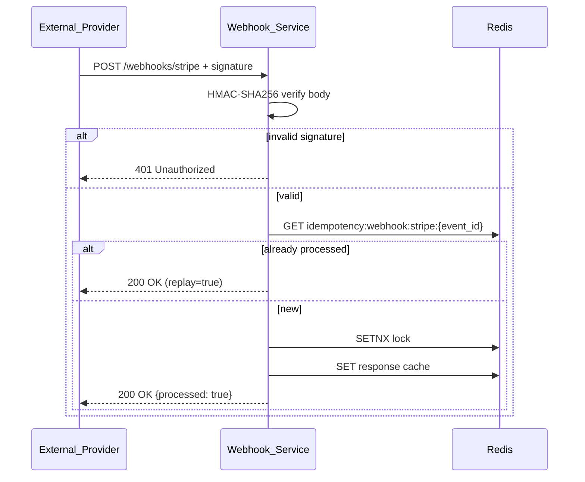
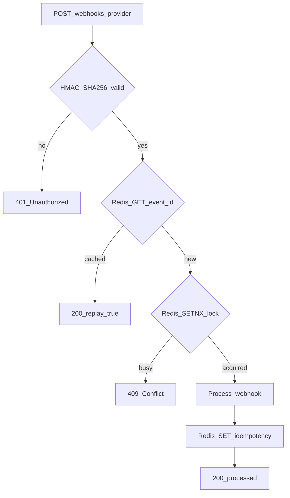
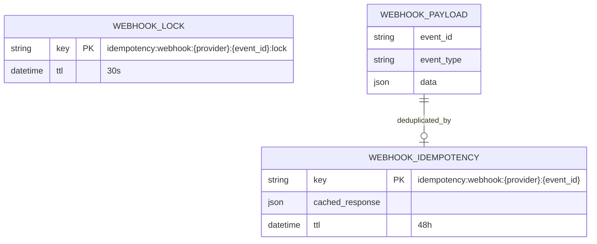

# Webhook Service

Receives and verifies provider callback webhooks with HMAC signature validation and idempotent processing via Redis.

| Property | Value |
|----------|-------|
| Port | `8008` |
| Stack | Gin, Redis |
| Persistence | Redis (idempotency only) |

## Responsibilities

- Accept provider webhook callbacks (`POST /webhooks/:provider`)
- HMAC-SHA256 signature verification
- Idempotent event processing (replay-safe)
- Replay attack prevention via Redis deduplication

## API Routes

| Method | Path | Headers | Description |
|--------|------|---------|-------------|
| POST | `/webhooks/:provider` | `X-Signature` or `Stripe-Signature` | Receive provider webhook |
| GET | `/health` | — | Health check |
| GET | `/metrics` | — | Prometheus metrics |

Supported providers: `stripe`, `razorpay`

## Workflow





## ERD (Redis)



## Security

| Mechanism | Detail |
|-----------|--------|
| HMAC verification | `sha256=HMAC(body, WEBHOOK_SECRET_{PROVIDER})` |
| Idempotency key | `webhook:{provider}:{event_id}` |
| Secret env vars | `WEBHOOK_SECRET_STRIPE`, `WEBHOOK_SECRET_RAZORPAY` |

## Run

```bash
HTTP_PORT=8008 \
WEBHOOK_SECRET_STRIPE=whsec_test_stripe \
WEBHOOK_SECRET_RAZORPAY=whsec_test_razorpay \
go run ./cmd/server
```
