# Payment Platform — Complete Workflow

End-to-end flows across all microservices. For per-service detail, see each [service README](README.md#architecture).

---

## 1. System Overview

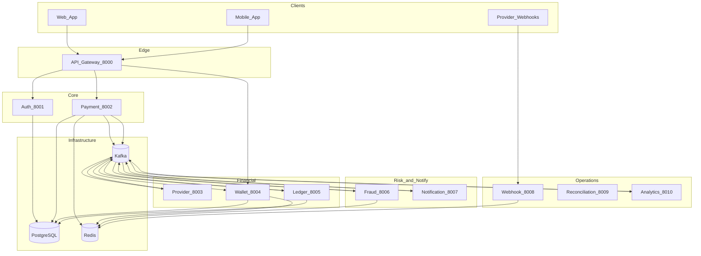

---

## 2. Authentication Flow

Public routes on the gateway proxy to auth-service. Protected routes require a valid JWT.

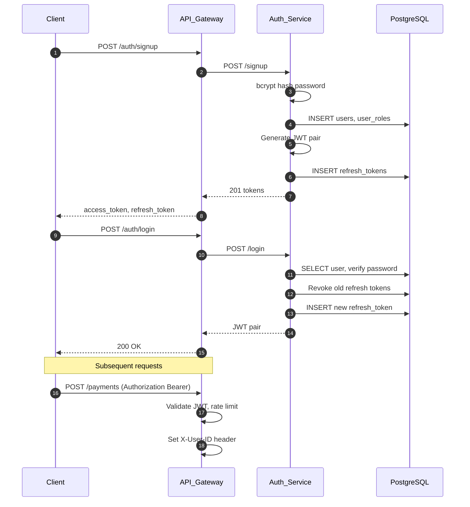

---

## 3. Create Payment (HTTP + Outbox)

Synchronous API write uses the **transactional outbox** so Kafka publish is never lost.

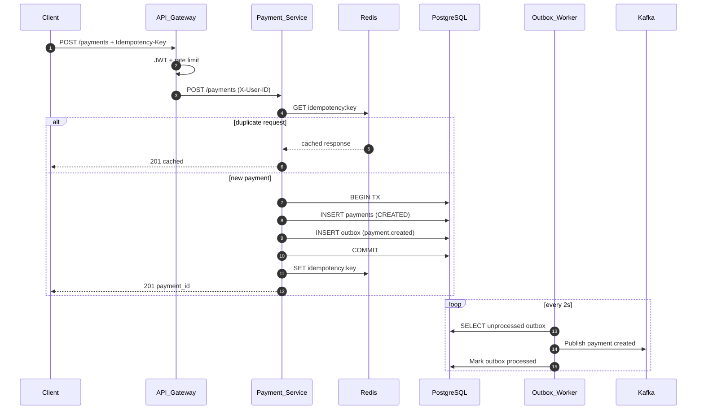

---

## 4. Payment Saga — Success Path

Orchestrated by **payment-service** via Kafka. Each step is async and idempotent.

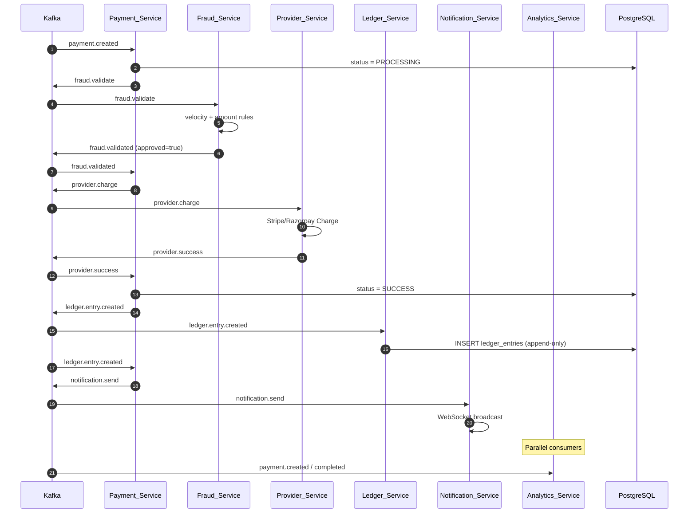

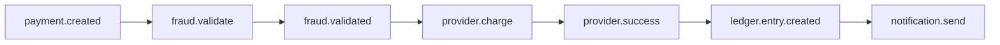

---

## 5. Payment Saga — Failure Paths

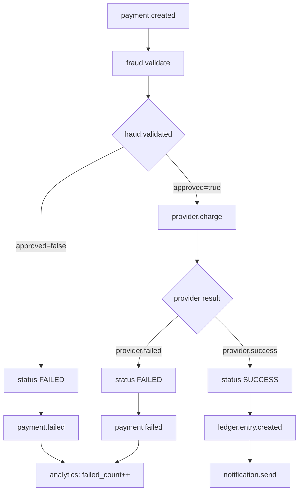

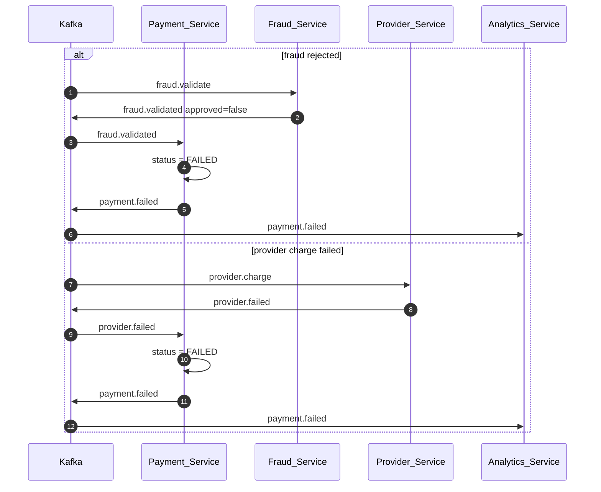

---

## 6. Payment State Machine

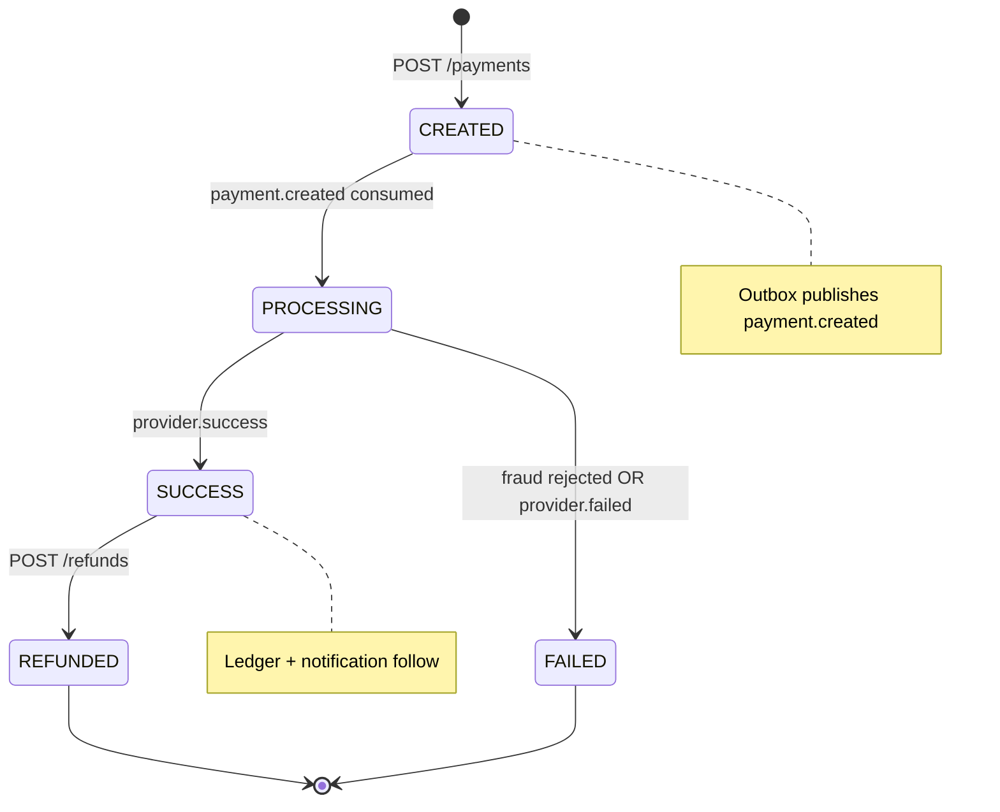

| Status | Trigger |
|--------|---------|
| `CREATED` | Payment inserted in DB |
| `PROCESSING` | Saga consumes `payment.created` |
| `SUCCESS` | `provider.success` received |
| `FAILED` | Fraud rejected or `provider.failed` |
| `REFUNDED` | `POST /refunds` on successful payment |

---

## 7. Refund Flow

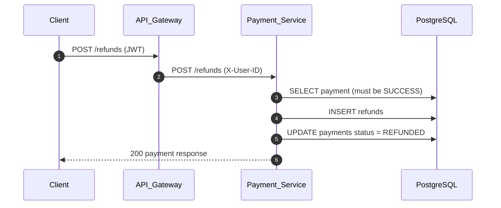

---

## 8. Wallet Flow

Wallet updates happen asynchronously via Kafka (and synchronously via `GET /wallet`).

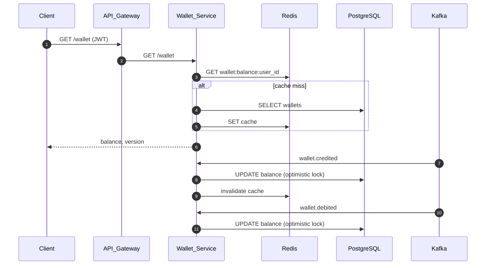

---

## 9. Provider Webhook Flow

External providers call webhook-service directly (not through the gateway).

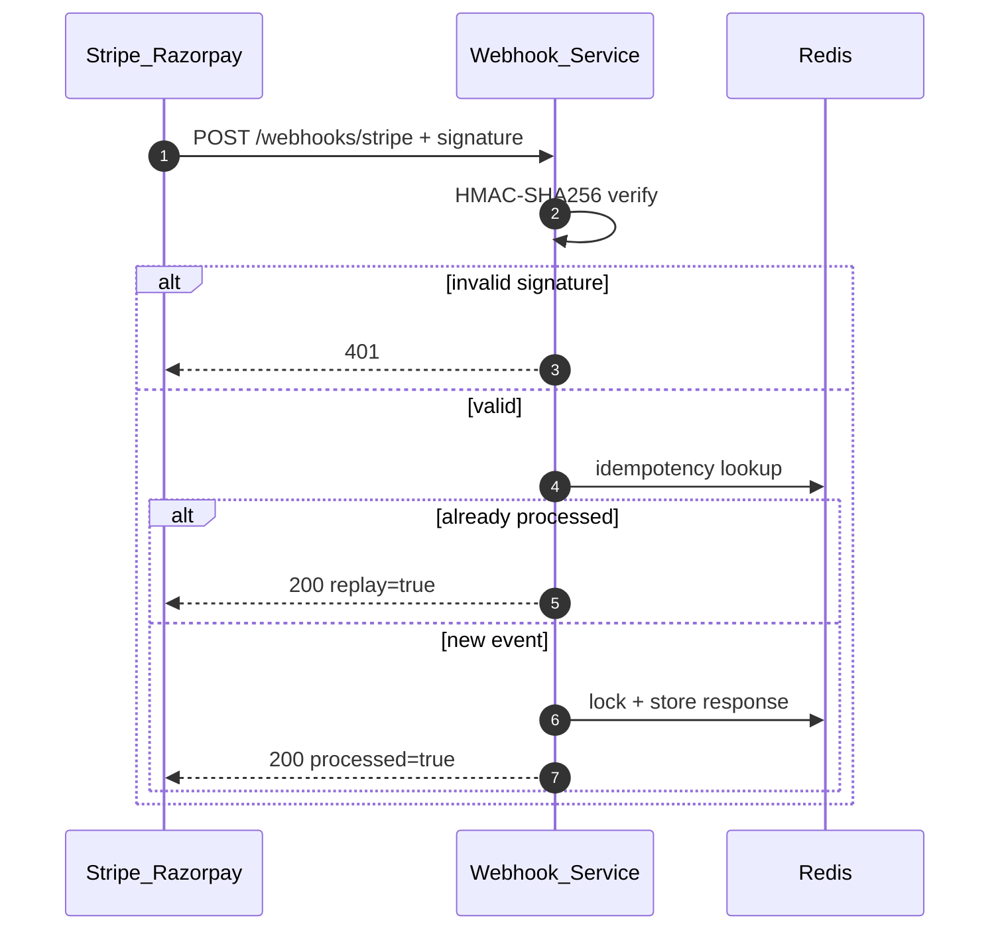

---

## 10. Reconciliation Flow

Operations team compares provider settlement files against ledger exports.

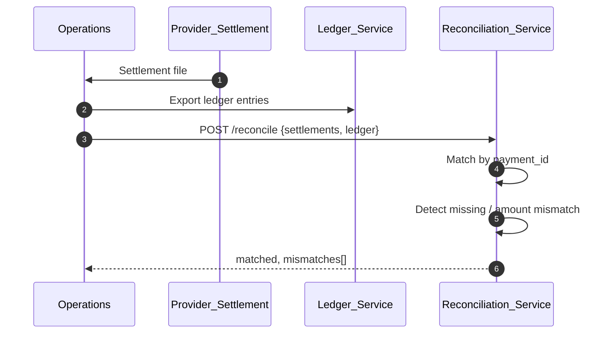

---

## 11. Analytics Flow

Analytics-service listens in parallel — it does not block the saga.

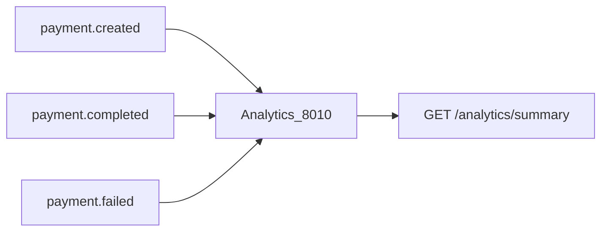

| Event | Metrics updated |
|-------|-----------------|
| `payment.created` | `total_payments++`, `total_volume += amount` |
| `payment.completed` | `completed_count++`, `completed_volume += amount` |
| `payment.failed` | `failed_count++` |

---

## 12. Kafka Topic Map

All topics partition by `payment_id` for ordering.

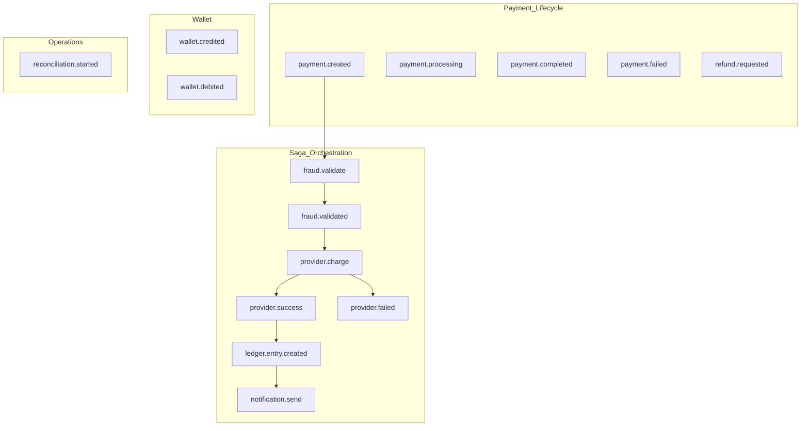

| Topic | Producer | Consumer(s) |
|-------|----------|-------------|
| `payment.created` | Outbox worker | payment-service (saga), analytics-service |
| `fraud.validate` | payment-service | fraud-service |
| `fraud.validated` | fraud-service | payment-service |
| `provider.charge` | payment-service | provider-service |
| `provider.success` | provider-service | payment-service |
| `provider.failed` | provider-service | payment-service |
| `ledger.entry.created` | payment-service | ledger-service, payment-service |
| `notification.send` | payment-service | notification-service |
| `payment.failed` | payment-service | analytics-service |
| `wallet.credited` | (external) | wallet-service |
| `wallet.debited` | (external) | wallet-service |

Retry/DLQ pattern: `{topic}.retry` → `{topic}.dlq` (see `shared/kafka`).

---

## 13. End-to-End Happy Path (Single Diagram)

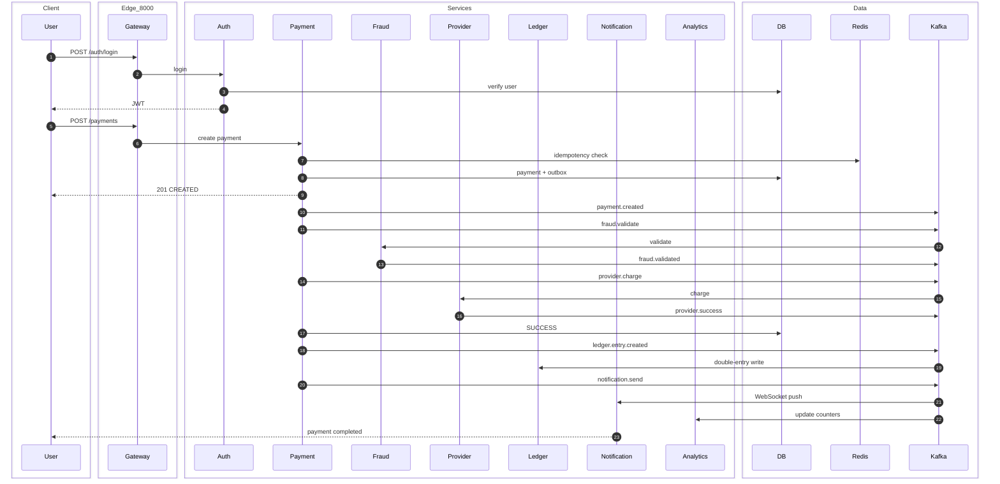

---

## 14. Service Ports Quick Reference

| Port | Service | Role in workflow |
|------|---------|------------------|
| 8000 | api-gateway | Entry, JWT, rate limit, proxy |
| 8001 | auth-service | Identity and tokens |
| 8002 | payment-service | Orchestrator, outbox, saga |
| 8003 | provider-service | External charge |
| 8004 | wallet-service | Balance read/update |
| 8005 | ledger-service | Accounting entries |
| 8006 | fraud-service | Risk gate |
| 8007 | notification-service | Real-time alerts |
| 8008 | webhook-service | Provider callbacks |
| 8009 | reconciliation-service | Settlement audit |
| 8010 | analytics-service | Metrics aggregation |

---

## 15. Refund Saga

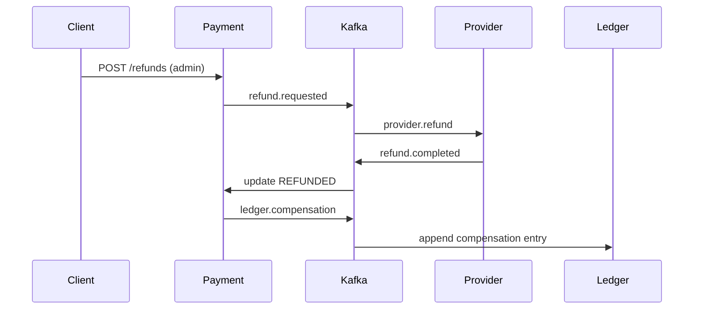

## 16. Auto Reconciliation

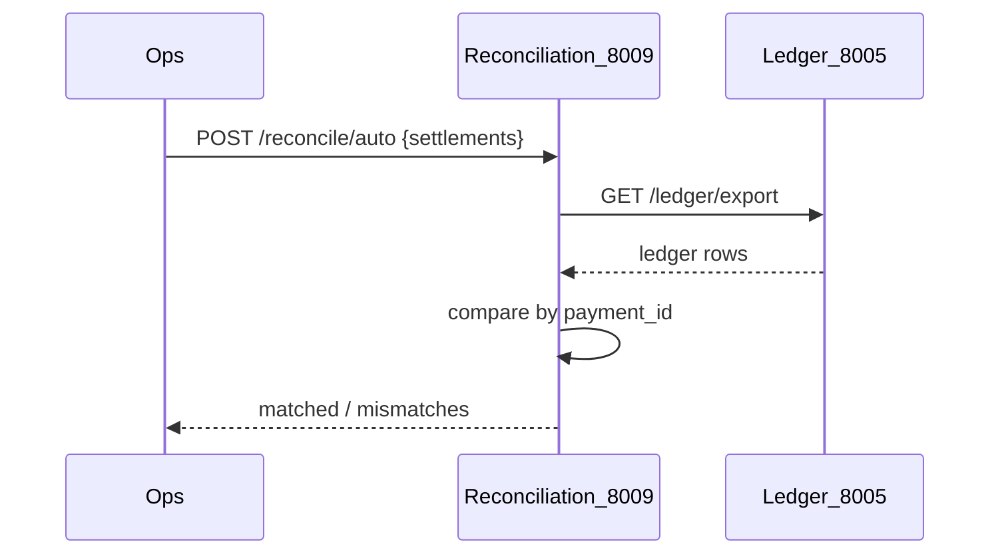

## 17. Webhook to Saga

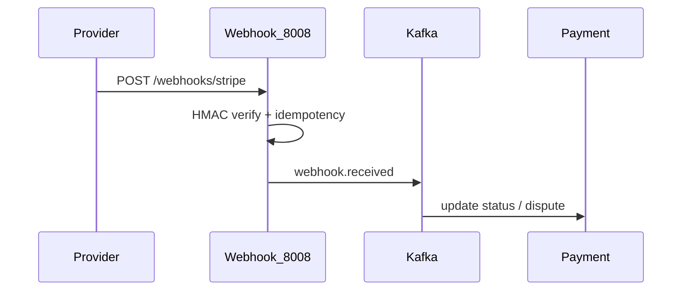

## Related Docs

- [README.md](README.md) — Quick start and project layout
- [docs/ENHANCEMENTS.md](docs/ENHANCEMENTS.md) — All implemented enhancements
- [docs/architecture.md](docs/architecture.md) — Local development setup
- [.md](.md) — Full platform blueprint (section 19: enhancements)
- Per-service READMEs under `services/*/README.md`
